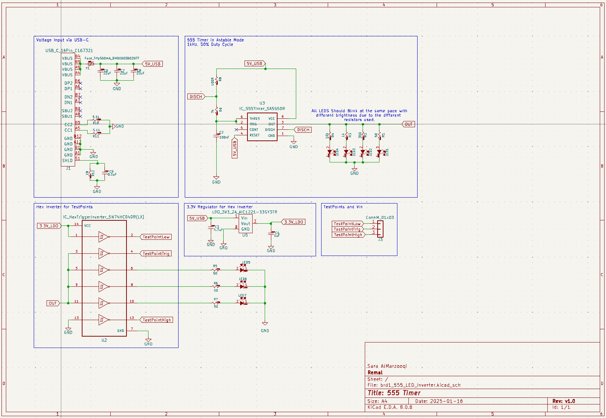
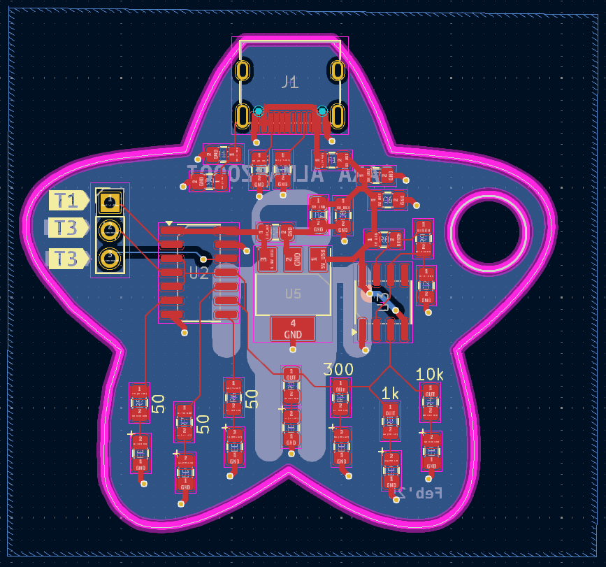

# 555 Timer Board Project
Sara's first PCB design board and is used for testing and measuring signals.

## Project Overview
Used 555 timer, Hex inverter and multiple LEDs to demostrate best design principles, current flow, and real-world testing using the testpoints. The circuit operates by pluging in the USB-C which gives us 5V to generate the 1kHz, 50% duty cycle signla using the 555timer, which then drives LEDs through different resistances. Additionally, a 3.3V LDO powers the hex inverted used for signal inversion and LED control.

## Features
- 555 Timer Circuit: Generates a 1 kHz square wave with 50% duty cycle.
- LED Driver: The 555 output drives four red LEDs through different resistances (10kΩ, 1kΩ, 300Ω, and 50Ω), demonstrating current variation.
- Voltage Regulation: A 3.3V LDO provides power to additional circuit components.
- Hex Inverter: - Outputs a testable logic high and logic low signal.
                - Inverts the 555 timer output and sends it to a test point.
                - Drives three additional LEDs via 50Ω resistors, using the 555 timer signal.

## Circuit Schematic

## PCB Layout

## Usage
To use the board:
1. Insert the USB-C Cabel
2. LED 1,2,3,4 should be oscillating at diffferent brighness
3. (if the LEDs dont blink) check voltage from the OUT pin and it should be oscillating
4. Use testpoints and verify the labels
5. Verify that the hex inverter LEDs doesnt blink with the 555 timer LEDs since they have to be opposite
